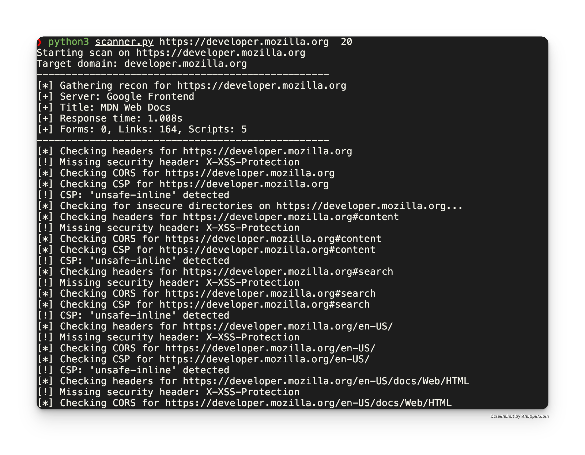

# Простой сканер веб-уязвимостей

Простой сканер веб-уязвимостей на Python. Проверяет распространенные неправильные конфигурации и простые уязвимости

## Возможности

- **Краулер**: Сканирует целевой веб-сайт на указанную глубину (по умолчанию 10 страниц)
- **Проверка заголовков безопасности**: Проверяет отсутствие заголовков безопасности, таких как `X-Frame-Options`, `Content-Security-Policy` и др.
- **Проверка CORS**: Обнаруживает неправильную конфигурацию CORS (например, wildcard `*`)
- **Проверка CSP**: Выявляет небезопасные директивы Content Security Policy (`unsafe-inline`, `unsafe-eval`)
- **Поиск чувствительных директорий**: Проверяет наличие чувствительных файлов и директорий (.git, .env, backup/, admin/ и др.)
- **Базовая разведка**: Собирает информацию о веб-приложении (сервер, технологии, формы, ссылки)

## Требования

- Python 3.x
- `requests`
- `beautifulsoup4`
- `pytest` (для тестирования)

## Установка

1. Клонируйте репозиторий
2. Создайте виртуальное окружение (опционально, но рекомендуется):
   ```bash
   python3 -m venv venv
   source venv/bin/activate
   ```
3. Установите зависимости:
   ```bash
   pip install -r requirements.txt
   ```

## Использование

Запустите сканер из командной строки:

```bash
python scanner.py <url> [--max-pages <число>]
```

Пример:

```bash
python scanner.py http://example.com --max-pages 20
```

## Тестирование

Запустите тесты с помощью pytest:

```bash
pytest test_scanner.py -v
```
### Структура тестов

Тесты организованы в следующие классы:

- `TestGatherBasicRecon` - тесты функции сбора базовой информации
- `TestCheckSecurityHeaders` - тесты проверки заголовков безопасности
- `TestCheckCors` - тесты проверки CORS
- `TestCheckCsp` - тесты проверки CSP
- `TestCheckInsecureDirectories` - тесты поиска чувствительных директорий
- `TestCrawlAndScan` - тесты основной функции краулинга

## Функции

### `check_security_headers(url, headers)`
Проверяет наличие важных заголовков безопасности.

### `check_cors(url, headers)`
Проверяет конфигурацию CORS на наличие небезопасных настроек.

### `check_csp(url, headers)`
Анализирует Content Security Policy на наличие небезопасных директив.

### `check_insecure_directories(url)`
Проверяет наличие чувствительных директорий и файлов.

### `gather_basic_recon(url)`
Собирает базовую информацию о веб-приложении (сервер, технологии, структура).

### `crawl_and_scan(start_url, max_pages=10)`
Основная функция краулинга и сканирования сайта.